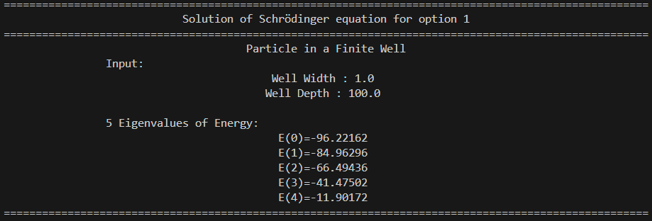
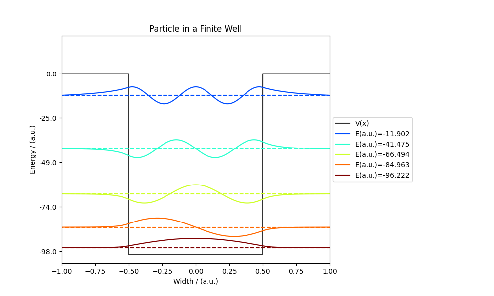

# Quantum-Solver

The program solves the one dimensional time-independent Schrödinger equation using the three-point finite difference method, offering a versatile tool for exploring quantum mechanics in various potentials. 
Users can analyze systems such as Finite Well, Harmonic Oscillator, Poschl-Teller, Double Finite Well, and Superlattice, gaining insights into the behavior of quantum particles in different 
potential landscapes.

## Getting Started

To get started with the program, follow these steps:

1. **Run the main Python script:**

    ```bash
    python main.py
    ```

This will execute the main program and initiate the solution of the time-independent Schrödinger equation in different potentials.

2. **Choose the potential V(x)**


3. **Example with selection 1**
   




Feel free to explore the code in `main.py` to understand the implementation details or customize the parameters for specific potentials.

## Prerequisites

Before you begin, ensure you have met the following requirements:

- **Python:** The program is written in Python. Ensure you have Python installed on your system. If not, you can download and install Python from [here](https://www.python.org/downloads/).

- **Dependencies:** The Python libraries used in this project are `scipy` and `matplotlib`. If you haven't installed them, you can do so by running the following command in your terminal:

  ```bash
  pip install -r requirements.txt
