# Quantum-Solver

**Quantum-Solver** is a Python program that numerically solves the **one-dimensional time-independent Schrödinger equation** using the **three-point finite difference method**. It provides an interactive way to explore quantum mechanics by solving for eigenvalues and wavefunctions in various potential energy landscapes.

## Features

- **Solves the Schrödinger equation** for different potentials.
- Supports the following potential types:
  - **Finite Well**
  - **Harmonic Oscillator**
  - **Poschl-Teller Potential**
  - **Double Finite Well**
  - **Superlattice**
- Generates and visualizes:
  - **Energy eigenvalues**
  - **Corresponding wavefunctions**
- Simple menu-based selection system.

---

## Getting Started

### 1. Dependencies

The Python libraries used in this project are `scipy` and `matplotlib`. If you haven't installed them, you can do so by running the following command in your terminal:

```bash
pip install -r requirements.txt
```

### 2. Run the Program
To execute the solver, run:

```bash
python main.py
```

This will execute the main program and initiate the solution of the time-independent Schrödinger equation in different potentials.

### 2. **Choose the potential**
After running the script, you will see a menu where you can select a potential:

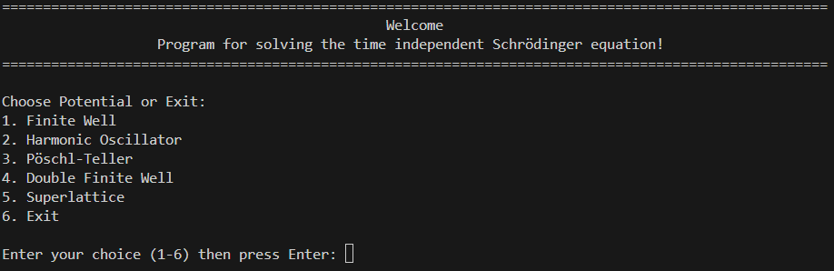

1. **Finite Well Output (Selection 1)**
   
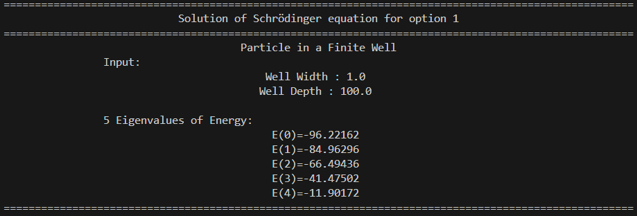

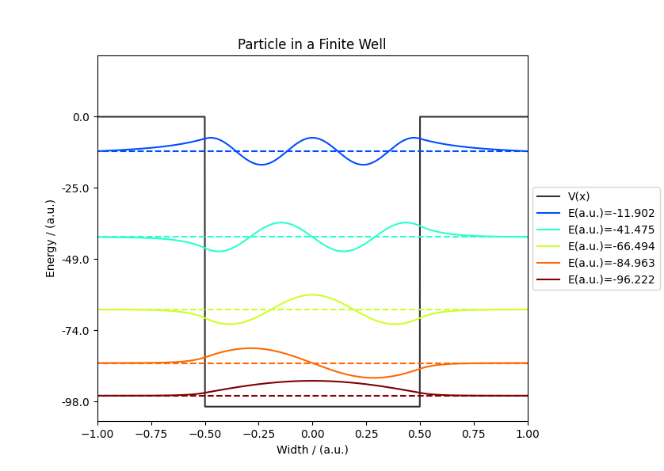

2. **Harmonic Well Output (Selection 2)**
   
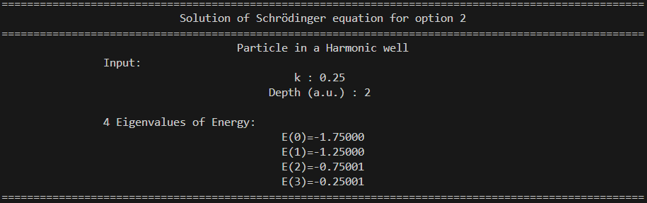

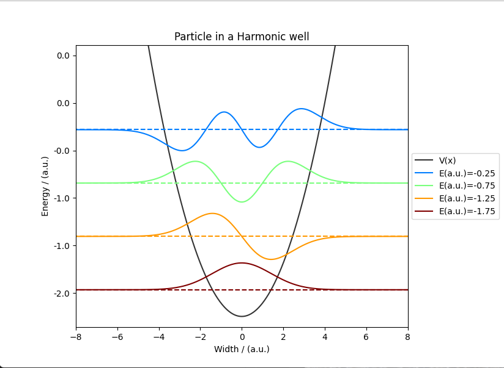

3. **Poschl - Teller Potential Output (Selection 3)**
   
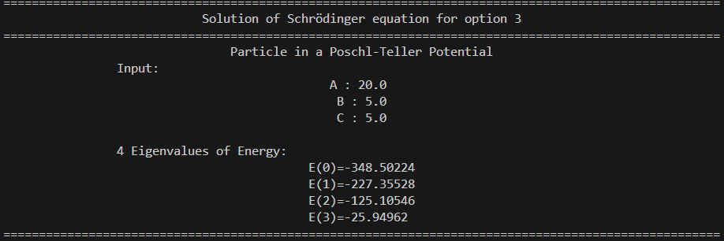

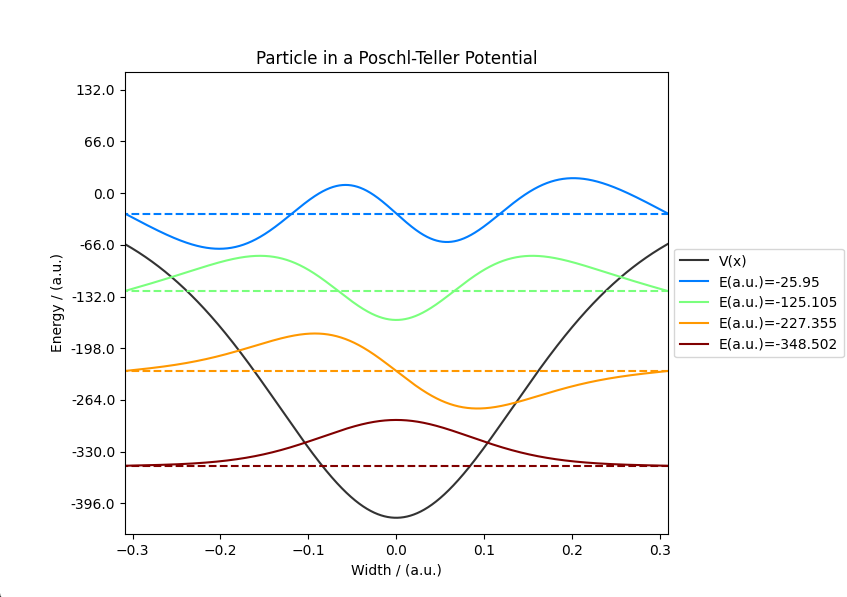

4. **Double Finite Well Output (Selection 4)**
   
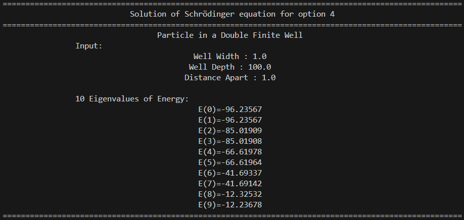

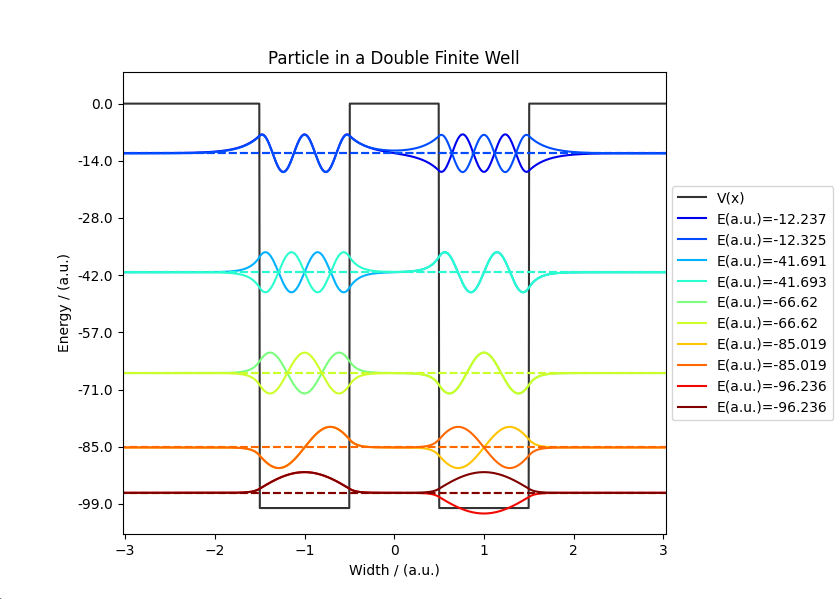

5. **Superlattice Output (Selection 5)**
   
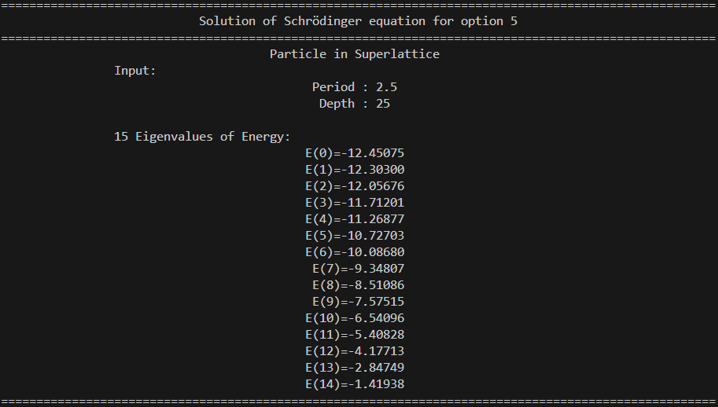

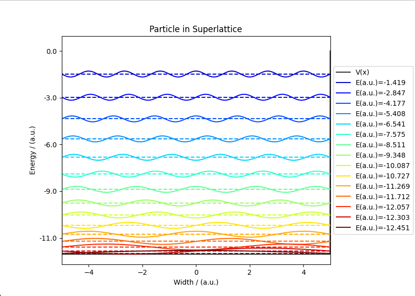

Feel free to explore the code in `main.py` to understand the implementation details or customize the parameters for specific potentials.